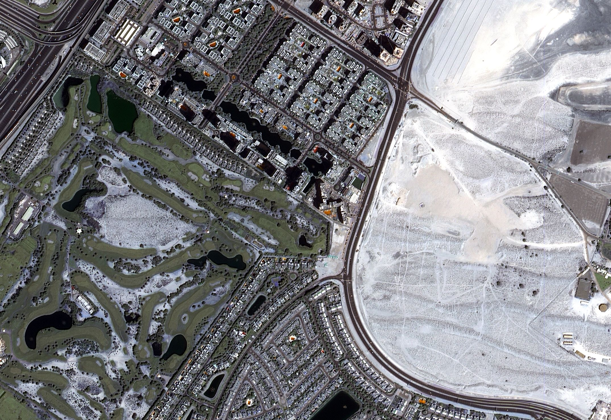
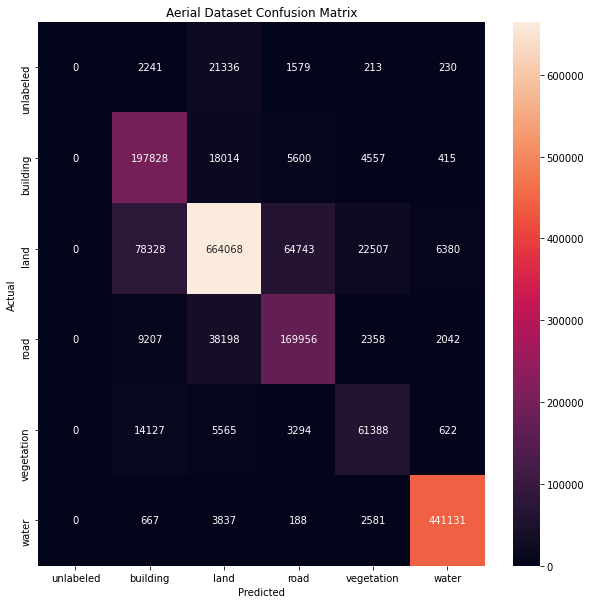
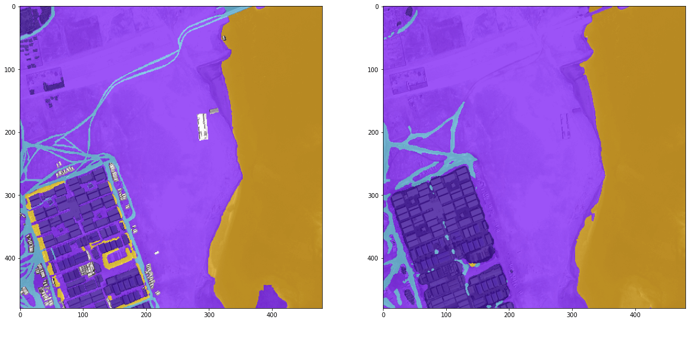
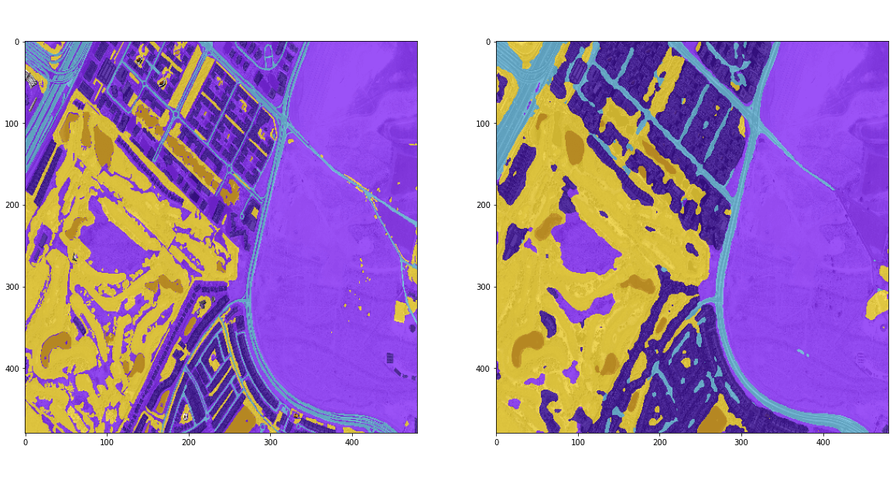
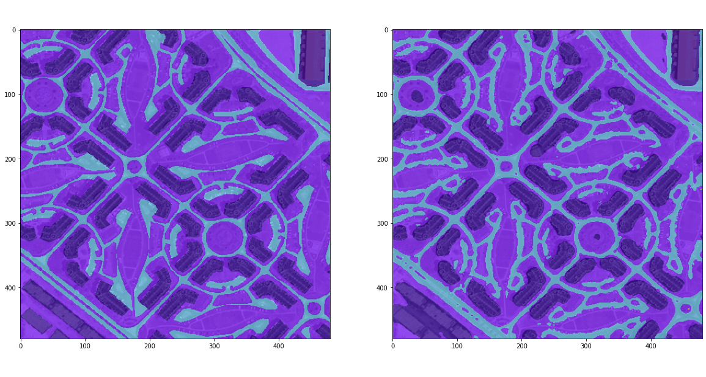
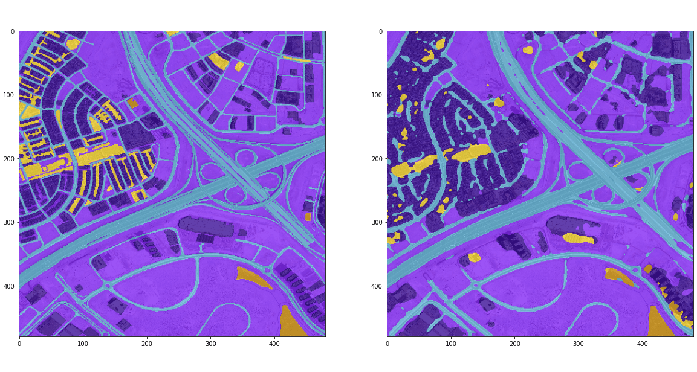
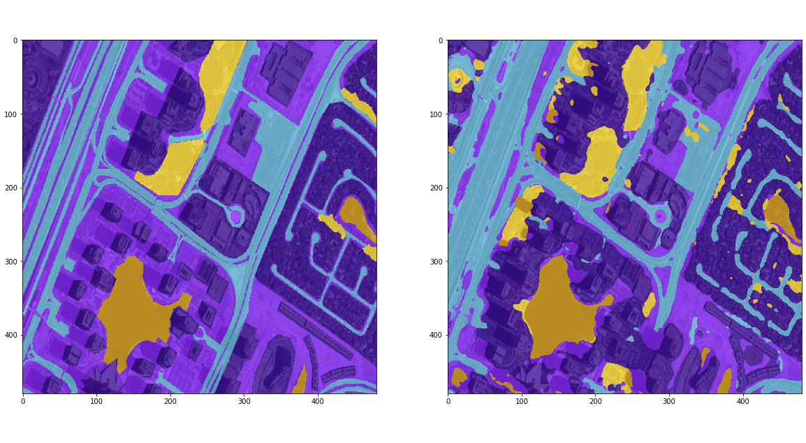

# Aerial Image Segmentation  

Semantic Segmentation of image, assigns a label to each pixel of the image. Images segmentation is very useful for traffic control, robotic surgery, medical diagonistic, self driving cars etc. It has potential to completely automate background substraction (used by ecommerce) and medical diagonistics.

# Dataset.

[Aerial Images](https://www.kaggle.com/humansintheloop/semantic-segmentation-of-aerial-imagery) dataset is used here. It has 8 tiles each tile has 9 images, overall 72 images. There are five classes building, land, road, vegetation, water and additional class for unlableed data.

First image of each tile was reserved for validation set, during training the images were upsampled by factor of 8 and augmentations were applied.

# Model
Since our dataset is quiet small, unet with resnet 50 backbone is a good fit.

# Evaluation 

Since pixelwise accuracy would be misleading, mIou was used to evaluate the performance of the model.

mIou 0.59, pixelwise accuracy 0.84

| Class | Iou |
| ---- | --- |
| water | 0.847082 |
| land | 0.711206 |
| building | 0.613619 |
| road | 0.559800 |
| vegetation | 0.264767 |

## Confusion Matrix

The unlabelled class must be ignored.

## Prediction

Prediction on validation dataset. Ground truth left, prediction right.

